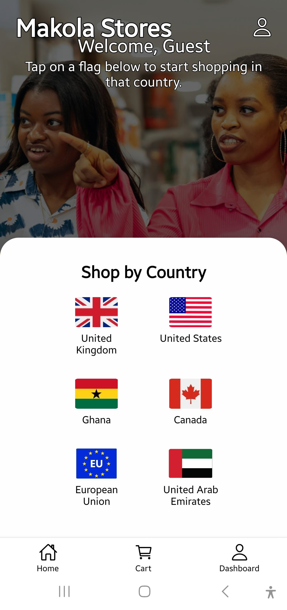
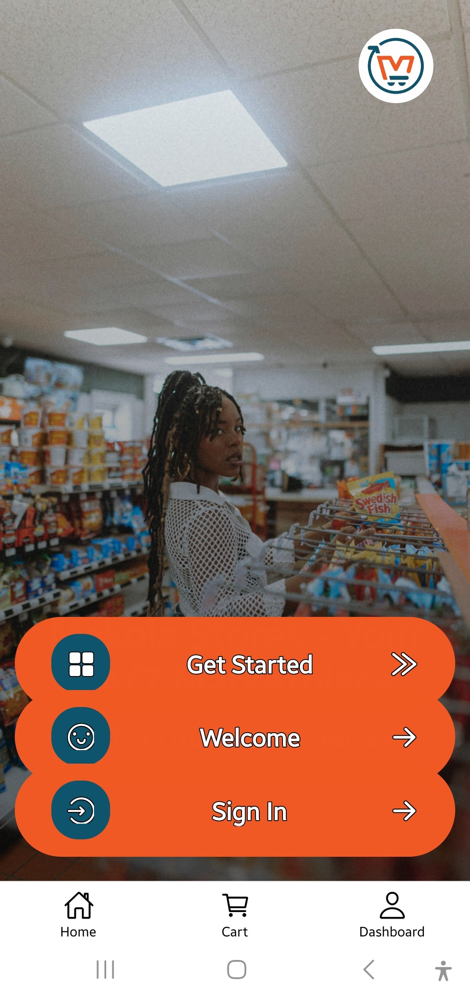
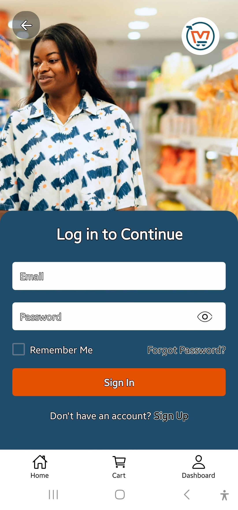
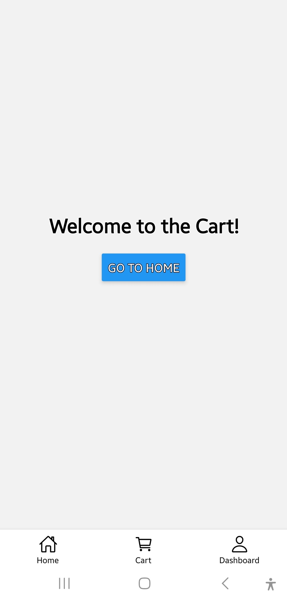

# 🛒 MakolaStore

**MakolaStore** is a multi-country e-commerce mobile app built with React Native and WooCommerce REST APIs. It allows users in Ghana, the US, and beyond to shop locally from their country-specific storefronts, all within one seamless app.

> Think of it as Jumia meets Amazon — built mobile-first for Africa and beyond.

---

## 🌍 Features

- 🗺️ Country-based store selection (Ghana, US, more)
- 🔐 Secure login/signup (JWT Auth – Ghana Store live)
- 🏠 Product browsing with flash sales, banners, categories
- 🛒 Cart & checkout flow
- 🚚 Order tracking
- 📱 Push notifications for new products (Ghana Store live)
- 👤 Profile screen with logout and order history
- 📦 Future US store support in progress

---

## 🧰 Tech Stack

| Layer        | Tools & Frameworks                          |
|--------------|----------------------------------------------|
| **Frontend** | React Native, TailwindCSS, Expo, Axios       |
| **Backend**  | WooCommerce REST API (JWT + Products + Orders) |
| **Auth**     | JWT via WP plugin                            |
| **Push**     | Custom WooCommerce functions + Expo Push API |
| **State**    | Context API, AsyncStorage                    |
| **Navigation** | React Navigation                          |

---

## 📦 Setup & Installation

```bash
# Clone the repo
git clone https://github.com/Blunttree-Gh/MakolaStore-repo.git
cd MakolaStore-repo

# Install dependencies
npm install

# Run development server
npx expo start
```

---

## 💻 Screenshots

### 🌍 Country Selector  


### 🏠 Home Screen  


### 🔐 Login Screen  


### 🛒 Cart Screen  


### 📦 Orders (Optional)  


---

## 🔗 Live Preview

📱 Try it on your phone with Expo Go:  
👉 [MakolaStore Expo Preview](https://expo.dev/@blunttree88/MakolaStoreAppp)

> Works best on mobile using the [Expo Go app](https://expo.dev/client)

---

## 📲 Android APK (Install)

👉 [Download MakolaStore APK](https://expo.dev/accounts/blunttree88/projects/MakolaStoreAppp/builds/9a67f6aa-5965-4736-9c21-e33de8599d87)

> Install the app directly on any Android device.  
> Make sure to enable “Install from unknown sources” in device settings.

---

## 🗂 Project Structure

```
/src
├── /components       # Reusable UI components
├── /screens          # Screens: Home, Cart, Login, etc.
├── /services         # WooCommerce API logic
├── /context          # Country/store context
├── App.js            # Main entry
```

---

## 🚧 Status & Roadmap

- ✅ Ghana Store Auth, Notifications → DONE  
- 🧪 US Store Integration → In progress  
- 📱 Mobile demo (Expo Go) → Ready  
- 📲 Android `.apk` available  
- 🌐 Hosting WooCommerce API → Active (makolastore.com)

---

## 🙋🏽‍♂️ Author

**Jonathan Haile-Selassie Azembah**  
💼 Full-Stack Developer | Mobile Dev | Cybersecurity Enthusiast  
📧 blunttree8819@gmail.com  
🔗 [GitHub](https://github.com/Blunttree-Gh) • [LinkedIn](https://linkedin.com/in/agambah)

---

## 📄 License

MIT License — free to use with credit.

> Let’s build mobile-first African e-commerce experiences together.
