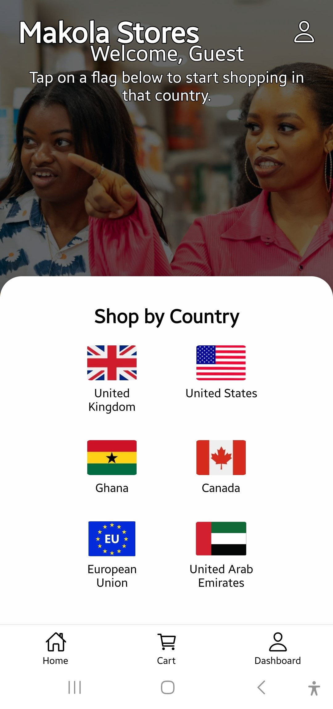
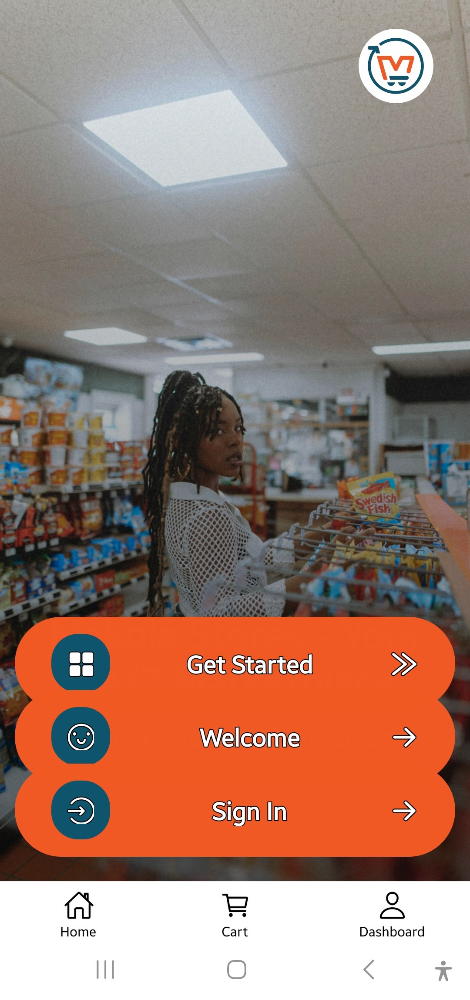
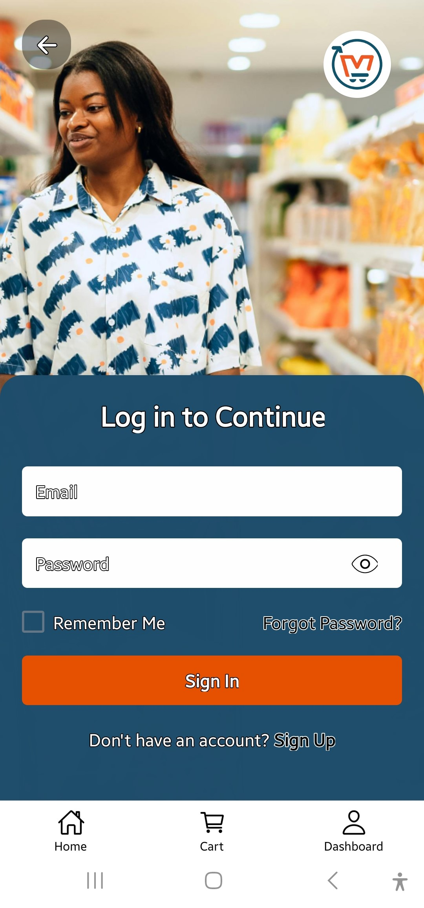
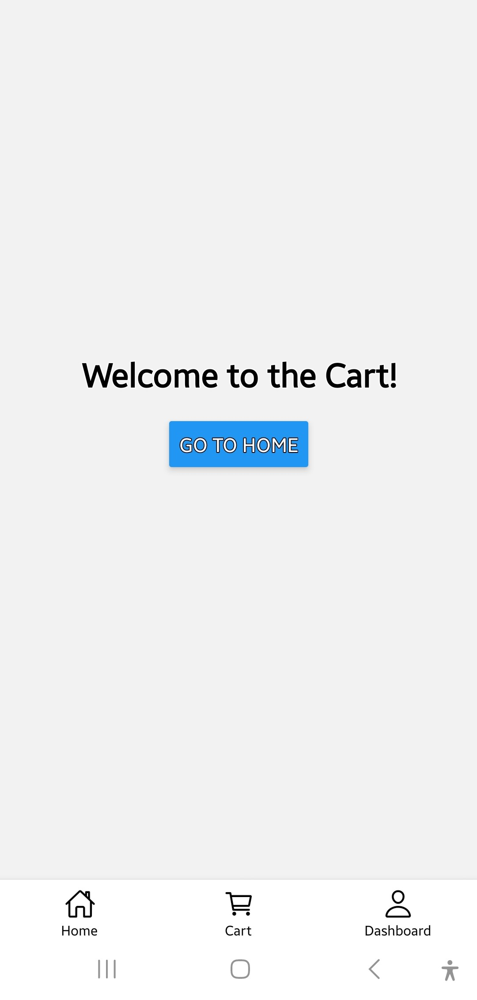

# 🛒 MakolaStore

**MakolaStore** is a mobile-first, multi-country e-commerce application built with **React Native and Expo**, integrating with **WooCommerce REST APIs** to provide country-specific shopping experiences from a single mobile application.

The project was built to explore how one application can support multiple markets while maintaining localized storefronts, authentication, products, orders, cart and checkout workflows.

---

## 🚀 Project Highlights

- 🌍 Multi-country storefront selection
- 🇬🇭 Ghana storefront integration
- 🇺🇸 US storefront integration in progress
- 🔐 JWT-based authentication
- 🛍️ Product browsing and categories
- 🛒 Cart and checkout
- 📦 Order history and tracking
- 🔔 Push notifications
- 👤 User profile and account management
- 💾 Persistent local state with AsyncStorage
- 🔌 WooCommerce REST API integration
- 📱 Android APK available
- ⚡ Expo development preview available

---

## 🎯 Why I Built This

MakolaStore was built as a practical exploration of mobile commerce and multi-market application architecture.

Rather than building only isolated UI screens, the project connects a mobile frontend to a real e-commerce backend and implements complete user flows:

**Country Selection → Authentication → Product Discovery → Cart → Checkout → Orders → Account**

The application is designed so that additional countries and storefronts can be introduced without creating an entirely separate mobile application for each market.

---

## 🏗️ Architecture

```text
React Native / Expo
        │
        ├── Screens
        ├── Reusable Components
        ├── Context / State
        └── Navigation
                │
                ▼
          API Services
                │
                ▼
       WooCommerce REST API
                │
        ┌───────┴────────┐
        ▼                ▼
   Ghana Store       US Store
```

---

## 🧰 Tech Stack

| Area | Technologies |
|---|---|
| Mobile | React Native, Expo |
| Language | JavaScript |
| UI | React Native, TailwindCSS |
| Navigation | React Navigation |
| API Communication | Axios |
| Backend | WooCommerce REST API |
| Authentication | JWT |
| State Management | Context API |
| Local Storage | AsyncStorage |
| Notifications | Expo Push API |
| Version Control | Git / GitHub |

---

## 📱 Application Screens

### 🌍 Country Selection

Allows users to select the storefront corresponding to their market.



### 🏠 Home Screen

Provides access to products, categories, promotional content and shopping functionality.



### 🔐 Authentication

User login and account authentication using JWT-based authentication.



### 🛒 Cart

Users can review selected products before proceeding through the checkout process.



---

## 🔗 Try the Application

### 📱 Expo Preview

The application can be previewed using Expo Go.

**[Open MakolaStore Expo Preview](https://expo.dev/@blunttree88/MakolaStore)**

> For the best experience, open the project on a mobile device using Expo Go.

### 📲 Android APK

An Android build is also available for direct installation.

**[Download / Install MakolaStore APK](https://expo.dev/accounts/blunttree88/projects/MakolaStore/builds/ab193838-3a15-48db-aec1-c11fd5dc9907)**

---

## 🧠 Engineering Challenges

One of the more difficult parts of developing MakolaStore was dealing with problems in the React Native/Expo Android development environment.

During development, I encountered issues involving:

- Dependency compatibility
- Expo / React Native configuration
- Gradle build configuration
- Android native tooling
- NDK compatibility
- Package conflicts
- Build and environment configuration

Rather than treating each error independently, I approached the problems by reproducing the failure, examining the build output, tracing the failure to the relevant dependency or configuration layer, making controlled changes and then rebuilding to verify the result.

This experience reinforced an important debugging principle:

> **The first error reported by a build system is not always the root cause.**

The process improved my ability to investigate problems across application code, dependencies and the underlying development environment.

---

## 🧩 Key Development Areas

### Multi-Country Architecture

The application uses country/store selection to determine which storefront users interact with.

This provides a foundation for expanding the application to additional markets without maintaining completely separate mobile applications for each market.

### API Integration

The mobile application communicates with WooCommerce through REST APIs for operations such as:

- Product retrieval
- Categories
- Authentication
- Orders
- Store-specific data

### Authentication

The application implements JWT-based authentication for user account functionality.

### State Management

React Context API is used for application-level state, while AsyncStorage provides local persistence where required.

### Notifications

The project integrates Expo Push Notifications with custom WooCommerce functionality to support product notification workflows.

---

## 📂 Project Structure

```text
/src
├── /components
│   └── Reusable UI components
│
├── /screens
│   ├── Home
│   ├── Login
│   ├── Signup
│   ├── Cart
│   ├── Products
│   └── Profile
│
├── /services
│   └── API and WooCommerce integration
│
├── /context
│   └── Application and store state
│
└── App.js
```

---

## 🚧 Current Status

| Feature | Status |
|---|---|
| Ghana Store | ✅ Active |
| Country Selection | ✅ Implemented |
| Authentication | ✅ Implemented |
| Product Browsing | ✅ Implemented |
| Cart | ✅ Implemented |
| Checkout Flow | ✅ Implemented |
| Order Tracking | ✅ Implemented |
| Push Notifications | ✅ Implemented |
| Android Build | ✅ Available |
| Expo Preview | ✅ Available |
| US Store Integration | 🚧 In Progress |
| Additional Markets | 🔮 Planned |

---

## 🗺️ Future Development

Planned improvements include:

- Additional country storefronts
- Expanded payment integrations
- Improved product search and filtering
- More advanced order tracking
- Improved notification workflows
- Improved offline handling
- Performance optimization
- Automated testing
- Expanded analytics
- Further backend/API improvements

---

## 👨🏽‍💻 About the Developer

**Jonathan Haile-Selassie Azembah**

**Junior Full-Stack Developer | React Native Developer | Cloud & Cybersecurity**

I enjoy building practical software products, integrating APIs and solving difficult technical problems.

My broader technical background includes:

- React / React Native
- JavaScript
- Node.js
- REST APIs
- AWS
- Git / GitHub
- Web development
- Mobile application development
- Cybersecurity

My cybersecurity background also influences how I approach application development, particularly around authentication, APIs, data handling and failure cases.

---

## 🔗 Links

- **GitHub:** https://github.com/Blunttree-Gh
- **LinkedIn:** https://linkedin.com/in/agambah
- **Project Repository:** https://github.com/Blunttree-Gh/MakolaStore-repo

---

## 📄 License

MIT License

---

> Built as a hands-on exploration of mobile commerce, API integration, multi-country architecture and real-world application debugging.